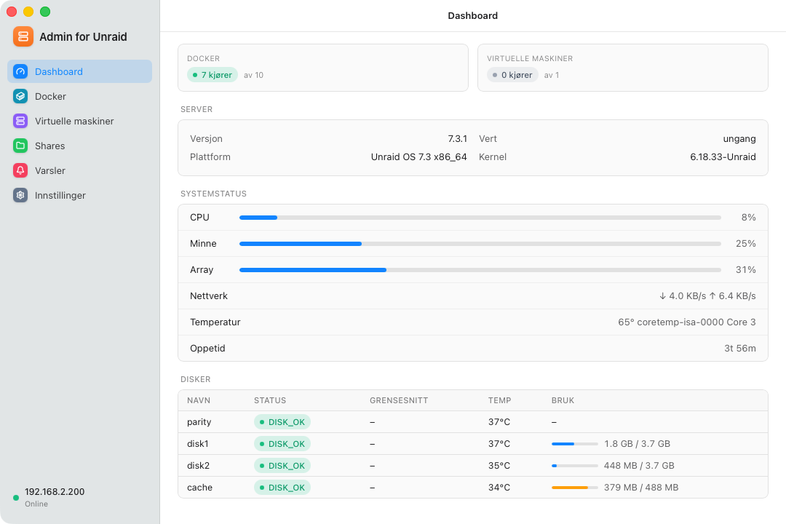
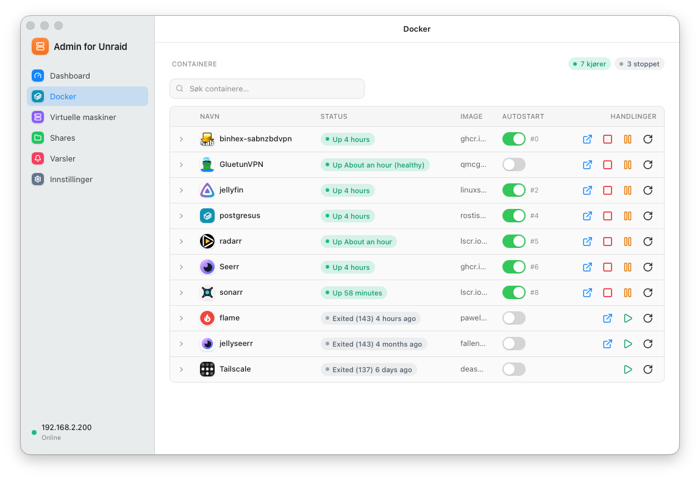
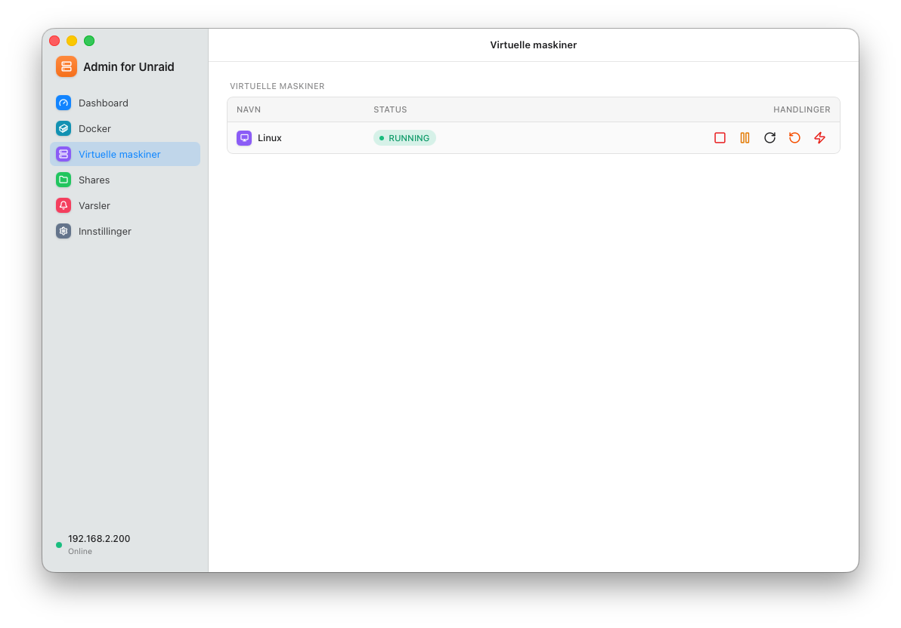
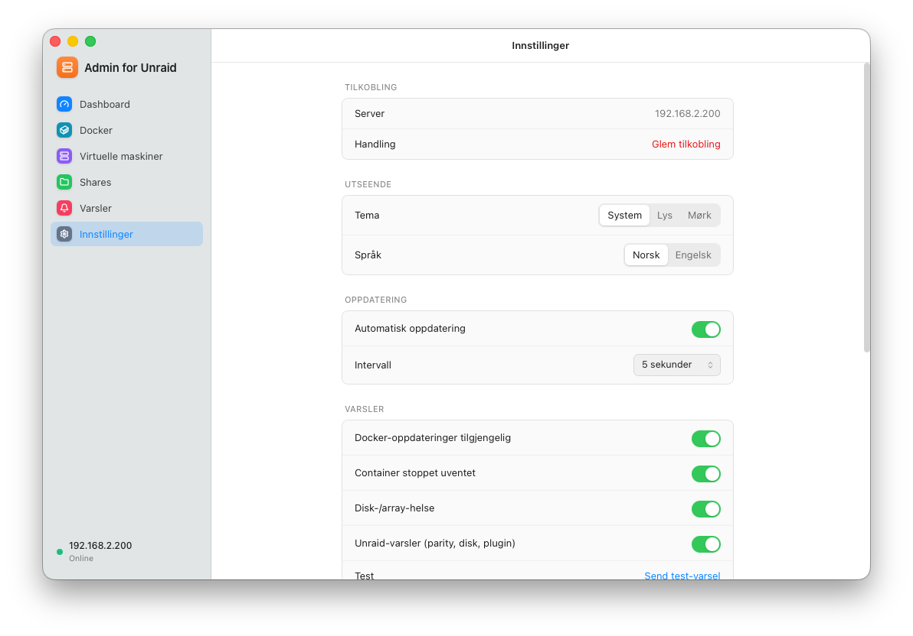
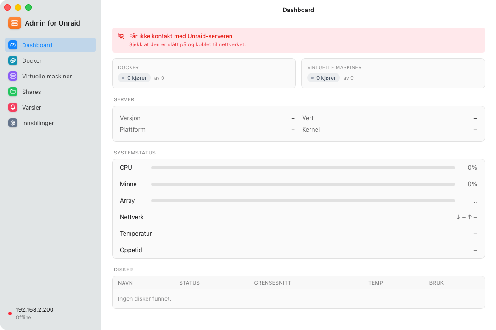

<p align="center">
  
</p>

<h1 align="center">Admin for Unraid</h1>

<p align="center">
  A native-feeling macOS menu bar app for monitoring and managing your Unraid server —
  system, array, Docker containers, and virtual machines — right from your Mac.
</p>

<p align="center">
  <picture>
    <source media="(prefers-color-scheme: dark)" srcset="docs/screenshots/dashboard_dark.png" />
    
  </picture>
</p>
<p align="center">
  <picture>
    <source media="(prefers-color-scheme: dark)" srcset="docs/screenshots/docker_dark.png" />
    
  </picture>
</p>
<p align="center">
  <picture>
    <source media="(prefers-color-scheme: dark)" srcset="docs/screenshots/vms_dark.png" />
    
  </picture>
</p>
<p align="center">
  <picture>
    <source media="(prefers-color-scheme: dark)" srcset="docs/screenshots/settings_dark.png" />
    
  </picture>
</p>
<p align="center">
  
</p>

## Features

- **Dashboard** — CPU, memory, array capacity, network throughput, temperature, and per-disk status at a glance
- **Docker** — start/stop/restart containers, view live resource usage, update images
- **Virtual machines** — start, stop, pause, and reset VMs
- **Shares** — usage, cache settings, and health for every share
- **Notifications** — view and dismiss Unraid alerts without opening the web UI
- Friendly, readable error states when the server is unreachable (instead of raw API errors)
- Light/dark mode, Norwegian and English localization, configurable refresh interval
- Talks directly to Unraid's official GraphQL API — no polling scripts, no plugins

## Installation

1. Download the latest `.dmg` from [Releases](https://github.com/frode81/unraid-admin/releases)
2. Drag **Admin for Unraid** into `Applications`
3. On your Unraid server, create an API key under **Settings → Management Access → API Keys**
4. Open the app and connect with your server address and API key

## Development

Built with [Tauri](https://tauri.app) (Rust) + React + TypeScript + Vite.

```sh
npm install
npm run tauri dev    # run in development
npm run tauri build  # build a release .dmg
```

Requires Rust and the standard [Tauri prerequisites](https://tauri.app/start/prerequisites/) for macOS.

## Disclaimer

Not affiliated with or endorsed by Lime Technology, Inc. Unraid® is a trademark of Lime Technology, Inc.
